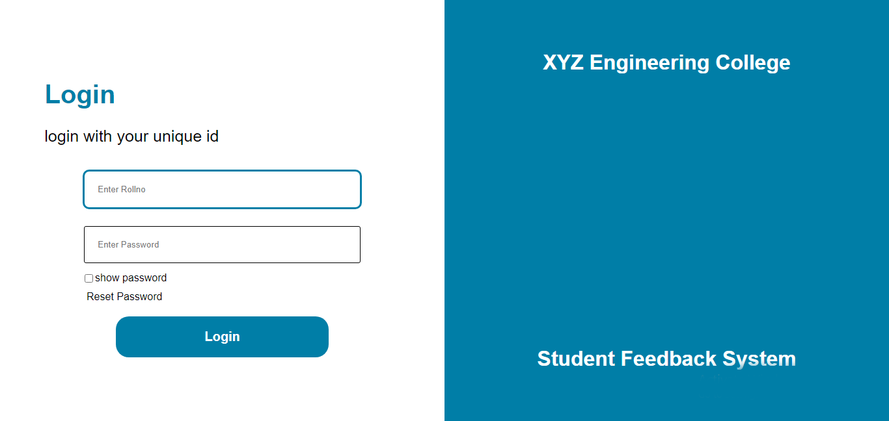
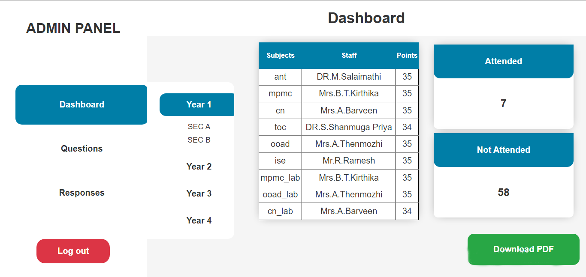
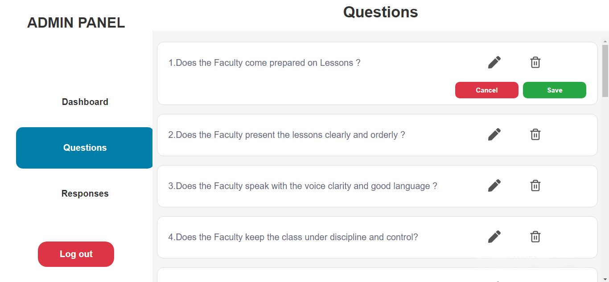
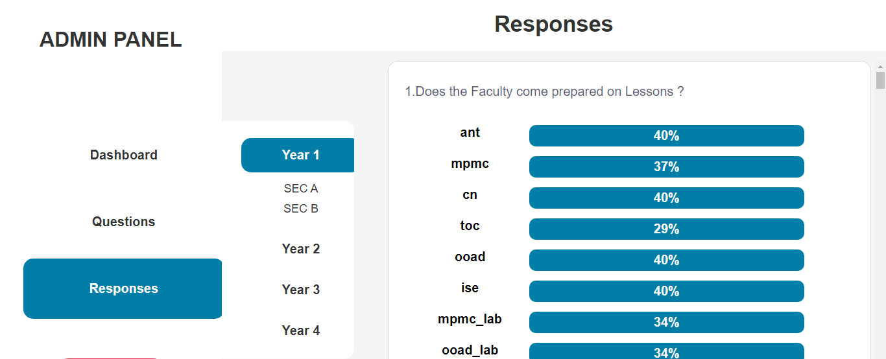
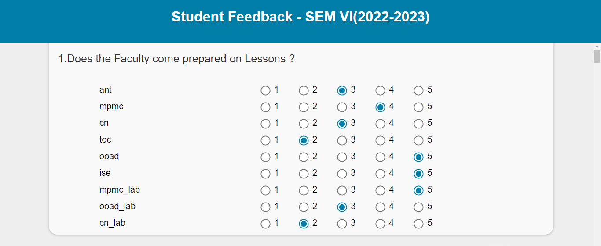

<h1>College Student Feedback System</h1>

This is a web application for collecting feedback from college students on various courses and instructors. The application is built using React JS for the frontend, Node JS and Express JS for the backend, and MySQL for the database.

<h1>Features</h1>
<ul>
  <li>Students can log in and provide feedback on their courses and instructors</li>
  <li>Students can change their password on login portal</li>
  <li>Admin can log in and view the feedback provided by their students</li>

  
 </ul>
 <h1>Software Required</h1>
 
Before running the application, make sure you have the following installed:

 <ul>
  <li>Node JS</li>
  <li>MYSQL</li>
  </ul>
  <h1>Preview</h1>
  

   

    

     

      

  <h1>Getting Started</h1>
  <ol>
<li>Clone this repository to your local machine.</li>
<li>Install the required dependencies by running npm install.</li>
<li>Start the Vite server by running 'npm run dev'</li>
<li>Start the Express Server by running 'nodemon server.js'</li>
<li>Open your web browser and navigate to http://localhost:5173</li>
</ol>
<h1>Technologies Used</h1>

This Student Feedback System was built using the following technologies:

<ul>
<li>React JS</li>
<li>Express JS</li>
<li>MYSQL</li>

</ul>
